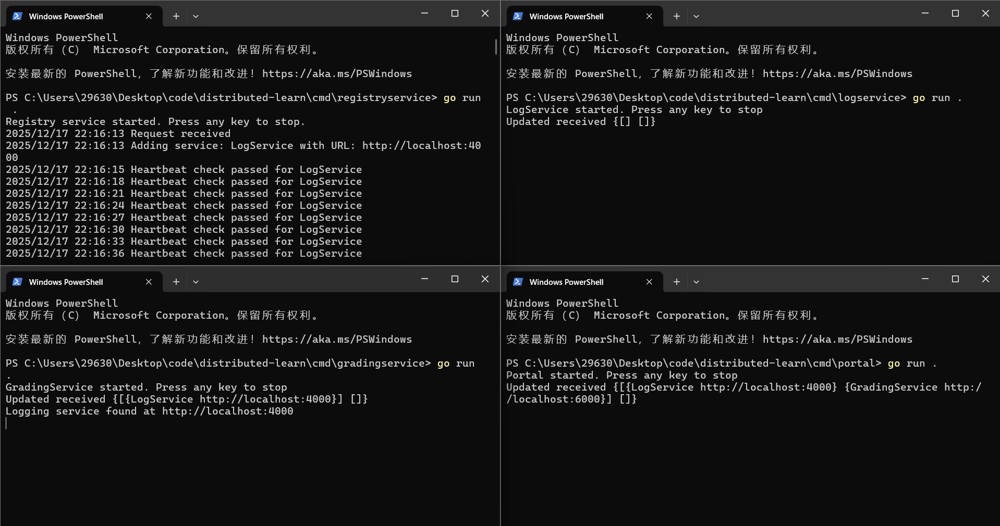

# Golang分布式学习

来自：[Go语言编写简单分布式系统（完结）](https://www.bilibili.com/video/av673216389)

可以查看commits看对应小节的内容

架构图：

启动图：

项目分析：
运行：分别启动registryservice、logservice、gradingservice、portal

系统主要组件
服务注册：服务注册、健康检查
用户门户：Web应用、API网关
日志服务：集中式日志
业务服务：业务逻辑、数据持久化

技术选型
开发语言：Go
框架：无
数据传输：HTTP
传输协议：JSON

./log/...

server.go
简单的日志服务，主要功能是将日志写入文件并通过HTTP接口接收日志

client.go
分布式日志客户端
1.日志集中收集：所有服务的日志发送到统一位置
2.透明集成：使用标准库接口，无需修改现有日志代码
3.服务标识：日志包含来源服务信息

./service/service.go
1.启动HTTP服务
2.向服务注册中心注册服务
3.提供优雅关闭机制
4.支持键盘中断关闭

./registry/...

server.go
内存型服务注册中心
1.服务注册与发现
2.健康检查
3.服务依赖通知
4.服务状态维护

registration.go
结构体集合

client.go
服务注册中心的客户端SDK
1.服务注册与注销
2.服务发现与负载均衡
3.服务更新通知处理

./grades/...

server.go
集成到分布式系统
1.服务发现：注册到registry，让其他服务能找到成绩服务
2.负载均衡：多个成绩服务实例通过注册中心分发请求
3.配置管理：从配置服务读取数据库连接等配置
4.监控指标：暴露/metrics端点供监控系统采集

grades.go
内存数据存储层
1.数据结构定义：学生、成绩等核心实体
2.业务方法：计算平均分、按ID查找等
3.数据存储：全局变量存储所有数据
4.并发控制：保护共享数据的互斥锁

mockdata.go
成绩服务的测试数据初始化代码

./portal/...

handlers.go
前端入口和API网关
1.路由转发
2.服务发现
3.模板渲染
4.表单处理

templates.go
模板初始化模块